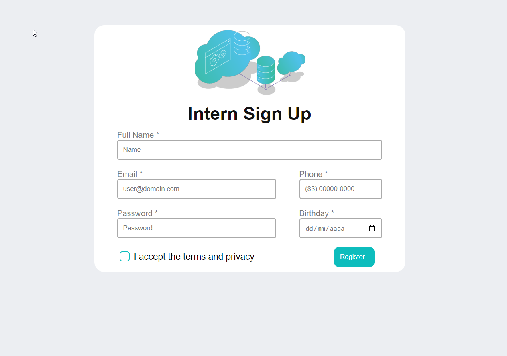

# Desafio Sprint 2 | Programa de Bolsas | Compass.UOL

- [Visão Geral](#visão-geral)
  - [Desafio](#desafio)
  - [Screenshots](#screenshot)
  - [Links](#links)
- [Processo](#processo)
  - [Construido com](#construido-com)
- [Validações](#validações)

## Visão Geral

### Desafio

Desenvolver uma tela de login para um sistema interno com validações.<br/>
O mesmo também possui avisos caso alguma informação, necessária, não seja preenchida corretamente.<br/>
Depois de preecher corretamente todos os campos, o usuário é direcionado a página "Sucess" onde poderá voltar para página de login.

### Screenshot
<div align="center">
    
    
    
</div>

### Links

- Solução: [Repositório GitHub](https://github.com/joaoatreto27/desafio_compass_2)
- Site: <a href="https://desafio-compass-vue.netlify.app/#/" target="_blank">Deploy</a>

### Construido com

- HTML5
- CSS
- Flexbox
- Vue.JS
- Sass


### Validações

- Full Name: Primeira letar maiúscula, no mínimo duas letras em cada palavra e no mínimo um espaço entre duas palavras;
- Email: Pelo menos duas letras antes e depois de um @ e duas letras depois de um ponto(.);
- Phone: Exatamente 11 caracteres;
- Password: Entre 6 e 9 caracteres;
- Birthday: Selecionar uma data;

## Project setup
```
npm install
```

### Compiles and hot-reloads for development
```
npm run serve
```

### Compiles and minifies for production
```
npm run build
```

### Lints and fixes files
```
npm run lint
```

### Customize configuration
See [Configuration Reference](https://cli.vuejs.org/config/).
